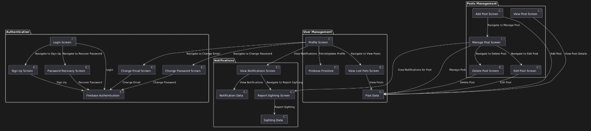

# 🐶🔎 Lost And Found

  
  

----

🐶🔎 **LostAndFound** is a mobile application for **Android** designed to help users report and track lost pets. The app allows users to create posts about missing animals, including essential details such as name, age, breed, last known location, and a photo of the pet. Other users can view these posts, report sightings, and communicate with the pet owners. The application features authentication through Firebase, profile management, password recovery with cooldown, and secure data handling via Firestore and Firebase Storage. It aims to provide a platform for the community to assist in reuniting lost pets with their owners in a simple, intuitive interface.

>**Important Note:** 🐶🔎 LostAndFound is not intended to replace professional pet recovery services or animal shelters. Instead, it aims to empower local communities by providing a platform for reporting and finding lost pets. LostAndFound offers a practical solution for individuals looking to reunite with their pets, ensuring that those in need of assistance can easily reach out to their neighbors and local community members. While the app helps bridge the gap, professional services should still be contacted in cases requiring immediate or specialized intervention.

----

## Table of contents

- [Motivation](#motivation)
- [Why Lost And Found](#why-lost-and-found)
- [How Lost And Found works](#how-lost-and-found-works)
- [Demo](#demo)

----

## Motivation

The motivation behind creating this application stemmed from a personal desire to learn mobile app development while also creating something useful for people. I wanted to combine my interest in technology with a practical tool that could help individuals in real-life situations. 

I decided to create this application because I believe pets are an important part of people's lives today, and helping people reunite with their lost pets could make a meaningful impact. By developing LostAndFound, I not only gained experience in building a mobile app, but also created a platform that could make a positive impact by helping people reunite with their lost pets.

----

## Why Lost And Found

The name **Lost And Found** was chosen because it directly reflects the main goal of the app: helping people find their lost pets. The phrase is easy to understand and familiar, making it a great fit for an app that aims to reconnect pets with their owners. It’s simple, memorable, and conveys the hope of reuniting with a lost pet.

----

## How Lost And Found works

The **Lost and Found** app is divided into four main components: **Authentication**, **User Management**, **Notifications**, and **Post Management**. Each of these sections represents different functionalities and user interactions within the app, as depicted in the diagram.

### **1. Authentication**
The **Authentication** handles all user sign-in, registration, and password recovery processes.

- **Login Screen**: This is the starting point for existing users. It allows them to log in with their credentials.
- **Sign Up Screen**: If a user doesn't have an account, they can navigate to the **Sign Up Screen** to create a new account.
- **Password Recovery Screen**: If a user forgets their password, they can navigate to this screen to recover their password.
- **Change Email Screen**: For updating their email, users can navigate to this screen from their account settings.
- **Change Password Screen**: This screen allows users to change their password securely.
- All authentication data is handled by **Firebase Authentication**.

### **2. User Management**
Once logged in, users can manage their profile and interact with other users' posts.

- **Profile Screen**: Users can view and edit their profile information here. It also allows fetching and updating their profile information.
- **View Lost Pets Screen**: This screen allows users to browse the lost pet listings.
- **Firebase Firestore**: All user data and posts are stored and managed using Firebase Firestore.

### **3. Notifications**
This section allows users to manage notifications related to sightings of lost pets.

- **View Notifications Screen**: Users can view all notifications about lost pets or sightings that have been reported.
- **Report Sighting Screen**: If a user spots a lost pet, they can report it on this screen, submitting the sighting details.
- **Notification Data**: All sighting and notification data is handled and stored in the app, enabling real-time updates for users.

### **4. Post Management**
Users can manage their lost pet posts through this section.

- **Add Post Screen**: Users can create new lost pet posts.
- **View Post Screen**: Once a post is created, users can view the details of their post.
- **Manage Post Screen**: From here, users can navigate to edit or delete their post.
- **Edit Post Screen**: This screen allows users to update details of their existing posts, such as adding new information or changing the pet's details.
- **Delete Post Screen**: If a user no longer needs a post, they can delete it.

## **Flow Summary**

1. **Authentication Flow**: The app starts with the user either logging in or signing up. If a user is logged in, they are directed to the **Welcome Screen**. If they need to reset their password, they can navigate to the **Password Recovery Screen**. The user can also change their email or password via dedicated screens.

2. **User Management**: Once authenticated, users can manage their profile and view or add lost pets through the **View Lost Pets Screen**. They can also interact with posts, reporting sightings of lost pets.

3. **Notifications Flow**: Users are notified about sightings of lost pets. They can view the notifications and report sightings of lost pets.

4. **Post Management**: Users can create, view, edit, and delete posts about their lost pets. If they create a post, they can return to manage it anytime.

This flow ensures that users can easily navigate through different features of the application, whether they are managing their personal profile, reporting sightings, or posting about lost pets. The clear separation into functional sections makes the app intuitive and user-friendly.

----

## Demo

For the demo, we have a YouTube video where we can see the functioning of the application and test some of its features. This is the [Demo](https://www.youtube.com/watch?v=Sna3rsezz7c).